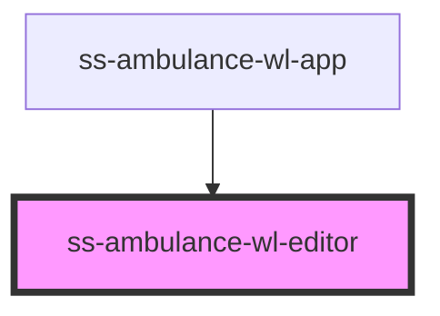

# ss-ambulance-wl-editor

<!-- Auto Generated Below -->

## Properties

| Property  | Attribute  | Description | Type     | Default     |
| --------- | ---------- | ----------- | -------- | ----------- |
| `entryId` | `entry-id` |             | `string` | `undefined` |

## Events

| Event           | Description | Type                  |
| --------------- | ----------- | --------------------- |
| `editor-closed` |             | `CustomEvent<string>` |

## Dependencies

### Used by

 - [ss-ambulance-wl-app](../ss-ambulance-wl-app)

### Graph

----------------------------------------------

*Built with [StencilJS](https://stenciljs.com/)*
